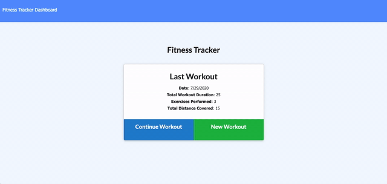

# ExerciseMe

[Link to app](https://arcane-dusk-01166.herokuapp.com/)

Client side application that records daily workout log.

# Technology Used

> 1. Javascript
> 2. Nodejs
> 3. MongoDB
> 4. Expressjs
> 5. Morgan
> 6. HTML
> 7. CSS

# Table of Contents

- [Instructions](#instructions)
- [Example Gif](#example-gif)
- [Contributors](#contributors)
- [Acknowledgements](#acknowlegments)
- [Author](#author)

## Instructions

> In your browser, navigate to https://arcane-dusk-01166.herokuapp.com/. When the window opens, click on "New workout" then enter desired workout in input fields and then click "Add Exercise" then add another exercise if desired. Once finished with all exercise entries, simply click "Complete" and you will be redirected to main page where your New workout is now logged. To continue to add to the same log, click "Continue Workout" and enter the new exercise desired and then click "Complete" and the new exercise will be added to your current workout totals. To begin a new workout log, begin at "New Workout" again, then click "Add Exercise" and a new log will be cerated.

# Example Gif:

## Contributors

[musicman785](http://github.com/musicman785)

## Author

**musicman785**

Email: null

Location: Los Angeles

Github: https://github.com/musicman785
